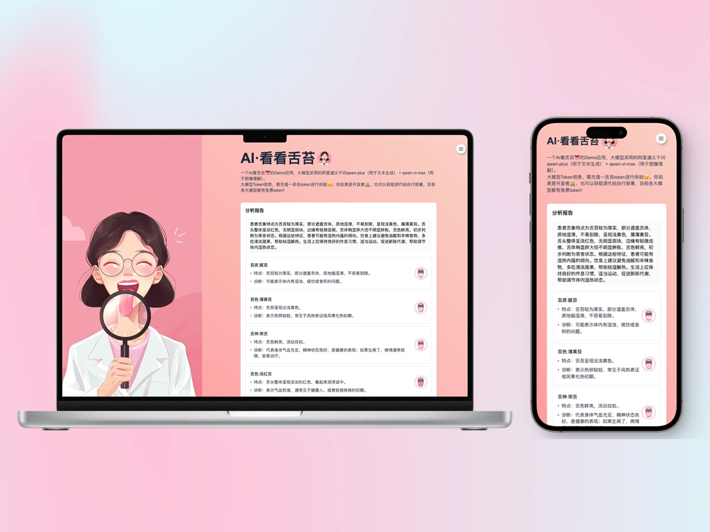
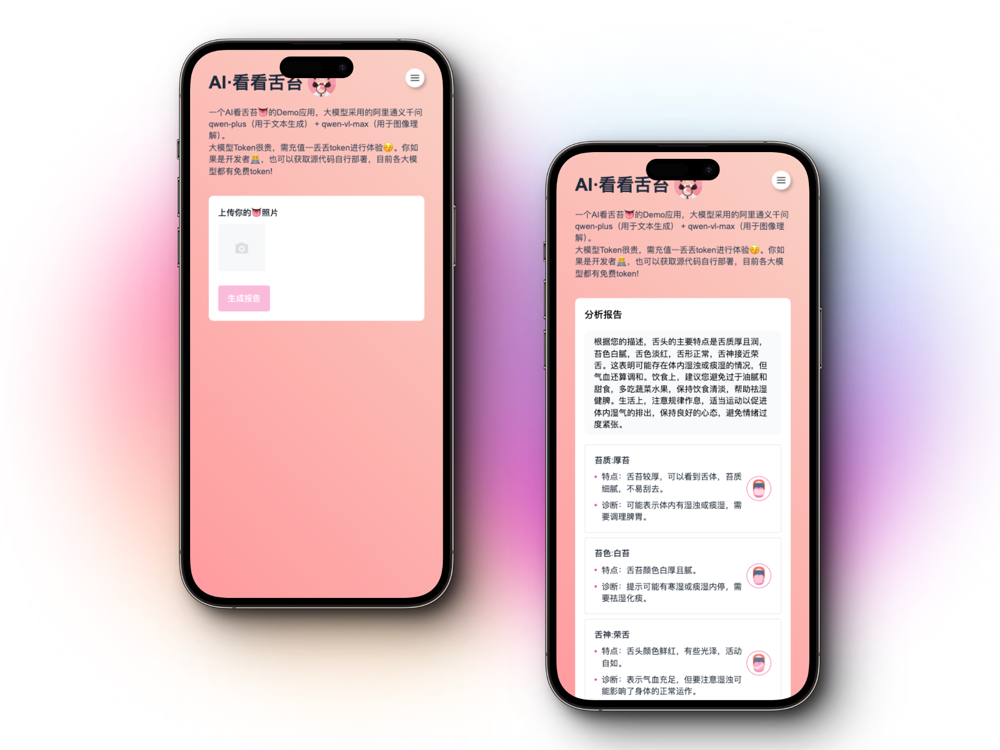
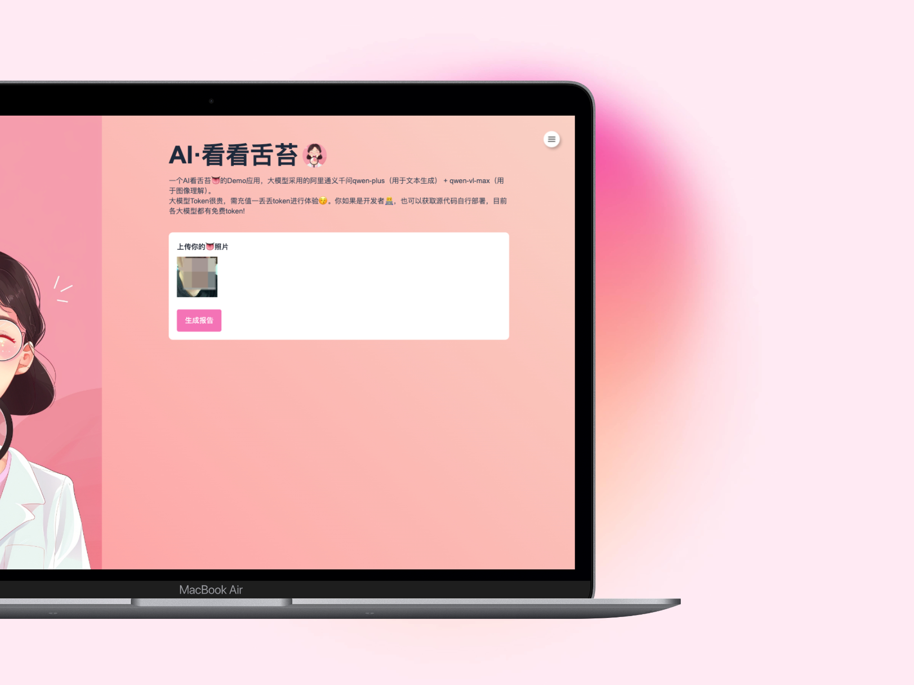
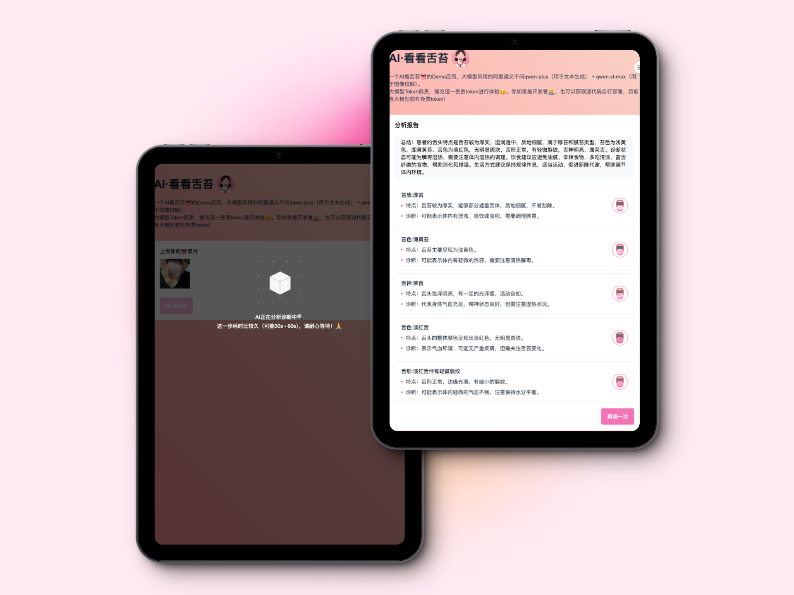
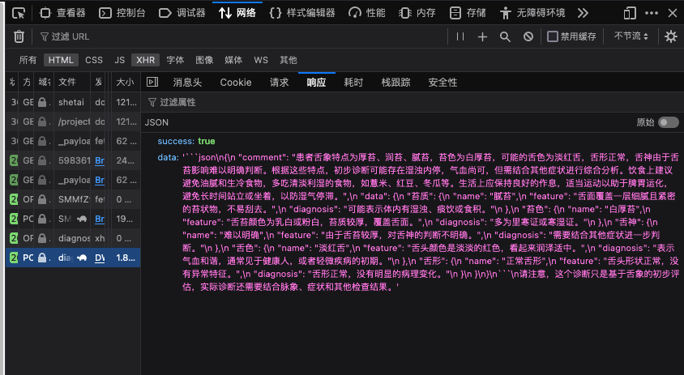

# 【教程】用 AI 看舌苔？我用通义千问开发了一个 AI 舌诊应用

> 笔者目前正在挑战基于国内的大模型创建 10个AI应用，相关的连载教程 + Demo体验地址会在[Github仓库](https://github.com/KapiAI/KapiAI-Apps)持续更新。
>
> 这是基于国内大模型创建 AI 应用的第 2 期。AI 应用的开发过程会同步到 B 站： [@卡皮 AI](https://space.bilibili.com/39930228)，欢迎大家关注。


## 项目介绍

笔者目前正在挑战：用国内的大模型开发 10 款有趣的 AI 应用（基于 web）。这 10 款 AI 应用的开发过程我都会同步发布到 B 站 @ 卡皮 AI，并且都会附带体验地址 + 详细教程  +  源码。

所有的项目都是基于 TailwindCSS 实现了响应式，同时支持网页端和移动端的显示效果。

这期尝试开发的 AI 应用是使用通义千问的大模型 API，开发一个 AI 看舌苔的应用。



整个项目的操作流程比较简单，第一屏用户上传自己的舌头的照片， 保存到 OSS 中。然后将 OSS 保存的图片发送给通义千问的大模型（这里采用了 qwen-vl  + qwen-max 两个大模型），让大模型生成我们的前端 JSON 数据并返回



整个项目使用到的技术栈如下：

- 前端

  - [Nuxt.js](https://nuxt.com/)：基于 Vue 的 SSR 和 SSG 框架
  - [Tailwind CSS](https://tailwindcss.com/)： 原子性的 CSS 框架，能很方便的的实现样式的搭建
  - [VantUI](https://vant-ui.github.io/vant/)：轻量、可定制的移动端组件库
  - [Supabase](https://memfiredb.com/)：目前基于的 MemFire Cloud 的 supabase 方案
- 后端

  - [Midway.js](https://midwayjs.org/)：阿里出的 Node.js 框架
  - [Supabase](https://memfiredb.com/)：目前基于的 MemFire Cloud 的 supabase 方案，实现数据库存储、OSS、鉴权
- AI

  - [OpenAI](https://www.npmjs.com/package/openai)： OpenAI 的 Node.js SDK
  - [阿里云 DashScope](https://dashscope.aliyun.com)：支持通义千问的能力直接调用

## 前端开发

前端使用是 Nuxt3，首页的前端代码如下，核心是两个组件 `UploadForm.vue` 和 `ReportData.vue`。分别对应上面提到的上传页面和报告页面

```javascript
<template>
  <div class="ai-shetai_page h-full">
    _<!-- 页面信息 -->_
    <Head>
      <Title>AI夜市·看看舌苔Demo</Title>
      <Meta
        name="description"
        content="AI夜市: 一个AI看舌苔👅的Demo应用，大模型采用的阿里通义千问qwen-plus（用于文本生成）+ qwen-vl-max（用于图像理解）。"
      />
      <Style
        type="text/css"
        children="body { background-color: white; }"
      ></Style>
    </Head>

    _<!-- 主体 -->_
    <main class="h-full flex">
      _<!-- 左侧 -->_
      <div class="flex hidden lg:block">
        
      </div>
      _<!-- 右侧 -->_
      <div class="flex-grow h-full overflow-y-auto p-8 lg:px-16 lg:py-14">
        <div class="max-w-2xl m-auto">
          <h2
            class="flex items-center text-3xl lg:text-5xl text-slate-800 font-bold"
          >
            <span>AI·看看舌苔</span>
            
          </h2>
          <p class="text-sm mt-4 text-slate-700">
            一个AI看舌苔👅的Demo应用，大模型采用的阿里通义千问qwen-plus（用于文本生成）
            + qwen-vl-max（用于图像理解）。
          </p>
          <p class="text-sm mt-0 text-slate-700">
            大模型Token很贵，需充值一丢丢token进行体验😚。你如果是开发者👨‍💻，也可以获取源代码自行部署，目前各大模型都有免费token!
          </p>
          <div class="bg-white mt-8 rounded-lg p-4 max-w-full lg:max-w-2xl">
            _<!-- 上传舌头照片 -->_
            <UploadForm v-if="type === 'upload'" />
            _<!-- 舌象分析 -->_
            <ReportData v-else />
          </div>
        </div>
      </div>
    </main>
  </div>
</template>

<script setup>
import { toRefs } from "vue";
import useProjectShetaiStore from "@/store/shetai";

const projectShetaiStore = useProjectShetaiStore();
const { type } = toRefs(projectShetaiStore);
</script>

<style>
.ai-shetai_page {
  background-image: linear-gradient(
    45deg,
    #ff9a9e 0%,
    #fad0c4 99%,
    #fad0c4 100%
  );
}
</style>
```

### 上传页面



`UploadForm.vue` 上传组件所对应的代码如下，上传采用的是 vant 的上传组件。

```javascript
<template>
  <div>
    _<!-- 上传照片 -->_
    <div>
      <label
        for="username"
        class="block text-sm font-medium leading-6 text-gray-900"
        >上传你的👅照片</label
      >
      <van-uploader
        class="mt-2"
        v-model="fileList"
        reupload
        max-count="1"
        accept="image/*"
        max-size="5 * 1024 * 1024"
        :after-read="afterRead"
        @delete="onDelete"
      />
    </div>
    _<!-- 生成报告的按钮 -->_
    <div class="mt-4">
      <van-button
        type="primary"
        class="!bg-pink-400 border !border-pink-400"
        :class="{
          'cursor-wait': isGenerating,
        }"
        :disabled="isDisabled"
        @click="projectShetaiStore.generateReport(uploadUrl)"
        >生成报告</van-button
      >
    </div>

    _<!-- 生成时的loading效果 -->_
    <van-overlay :show="isGenerating">
      <div class="mt-[25vh]" @click.stop>
        <CubeLoading
          textCSS="text-white text-center leading-6 text-sm mt-4"
          text="AI正在分析诊断中🔍<br/> 这一步耗时比较久（可能30s - 60s），请耐心等待！🙏"
        />
      </div>
    </van-overlay>
  </div>
</template>

<script setup>
import { computed, toRefs } from "vue";
import { BUCEKT } from "@/utils/constants";
import useUpload from "@/composables/useUpload";
import useProjectShetaiStore from "@/store/shetai";

_// 上传文件_
const { fileList, uploadUrl, afterRead, onDelete } = useUpload(BUCEKT.SHE_TAI);

_// 生成报告_
const projectShetaiStore = useProjectShetaiStore();
const { isGenerating } = toRefs(projectShetaiStore);

_// 是否禁用生成报告的按钮_
const isDisabled = computed(() => !uploadUrl.value || isGenerating.value);
</script>
```

图片上传到 OSS 的逻辑，我是采用的开源的 Supabase 方案，核心的上传代码逻辑封装到了 `@/composables/useUpload.js` 中。我它的代码逻辑如下：

```javascript
import { ref, toRefs } from "vue";
import moment from "moment";
import { nanoid } from "nanoid";
import { showFailToast, showSuccessToast } from "vant";
import { useSupabase } from "@/composables/useSupabase";

const useUpload = (bucketName) => {
  _// supabase实例_
  const supabase = useSupabase();
  _// 文件列表_
  const fileList = ref([]);
  _// 文件上传成功地址_
  const uploadUrl = ref("");

  async function uploadImageToOSS(vantFile) {
    const { file } = vantFile;
    const filename = file.name;
    const date = moment().format("YYYY-MM-DD");
    const uid = nanoid(10);
    const PATH = `images/${date}/${uid}-${filename}`;

    const { data, error } = await supabase.storage
      .from(bucketName)
      .upload(PATH, file, {
        cacheControl: "3600",
        upsert: false,
      });

    return {
      data,
      error,
    };
  }

  _// 读取文件完毕触发的回调_
  async function afterRead(vantFile) {
    vantFile.status = "uploading";
    const res = await uploadImageToOSS(vantFile);

    if (res.error) {
      vantFile.status = "failed";
      const errorMsg = res.error.error || res.error.message || "上传失败";
      showFailToast(errorMsg);
    } else {
      const { data } = supabase.storage
        .from(bucketName)
        .getPublicUrl(res.data.path);

      const { publicUrl } = data;
      vantFile.status = "done";
      uploadUrl.value = publicUrl;

      showSuccessToast("上传成功");
    }
  }

  _// 删除文件触发的回调_
  function onDelete() {
    uploadUrl.value = "";
  }

  return {
    fileList,
    uploadUrl,
    afterRead,
    onDelete,
  };
};

export default useUpload;
```

这边 Supabase 方案采用的是 [MemfireDB](https://memfiredb.com/) 的方案，因为它提供了很好的国内访问性，而且开发者具有创建 2 个免费额度的权益。我很安利独立开发者使用 Supabase 开发项目，因为它提供了数据库、OSS 存储和登录鉴权方案，只需要调用一个函数就能实现后端功能，能够极大的提高我们的开发效率，对前端同学非常友好。

并且不像 Google 提供的 Firebase，国内的访问性不佳，我们可以采用一套技术栈，实现国内和海外的 Supabase 方案同构。

### 报告页面



上传成功后就可以点击生成报告，因为大模型的响应时间比较久，我这边没有考虑增加 stream 返回数据等相关优化。所以增加了一个 loading 的动效。上传组件 `ReportData.vue` 的源码如下：

```typescript
<template>
  <div>
    <h3 class="font-medium">分析报告</h3>
    <div class="mt-4 bg-slate-50 px-4 py-2 rounded-lg text-sm">
      {{ comment }}
    </div>
    <div class="mt-4">
      <div
        class="flex items-center mt-2 text-sm border px-4 py-4 rounded text-gray-800"
        v-for="(item, index) in diagnosis"
        :key="item.id"
      >
        <div class="flex-grow">
          <div class="font-medium">{{ item.id }}:{{ item.name }}</div>
          <div class="mt-2 flex">
            <i class="rounded-full w-1 h-1 bg-pink-500 mt-2 mr-2 flex-none"></i
            >特点：{{ item.feature }}
          </div>
          <div class="mt-2 flex">
            <i class="rounded-full w-1 h-1 bg-pink-500 mt-2 mr-2 flex-none"></i
            >诊断：{{ item.diagnosis }}
          </div>
        </div>
        <div class="flex-none rounded-full border p-1 border-pink-400 ml-2">
          
        </div>
      </div>
    </div>

    <div class="mt-4 flex justify-end">
      <van-button
        type="primary"
        class="!bg-pink-400 border !border-pink-400"
        :class="{
          'cursor-wait': isGenerating,
        }"
        @click="() => projectShetaiStore.clearCache()"
        >再测一次</van-button
      >
    </div>
  </div>
</template>

<script setup>
import { computed, toRefs } from "vue";
import useProjectShetaiStore from "@/store/shetai";

const projectShetaiStore = useProjectShetaiStore();
const { reportData } = toRefs(projectShetaiStore);

function parseAIJSON(aiContent) {
  const content = aiContent.replace(/\\n/g, "");
  const regex = /```json\s([\s\S]*?)\s```/;
  const matches = content.match(regex);

  if (matches && matches.length) {
    try {
      const jsonString = matches[1];
      const data = JSON.parse(jsonString);

      return data;
    } catch (error) {
      console.error(error);
      return null;
    }
  } else {
    return null;
  }
}

const data = computed(() => {
  let json = parseAIJSON(reportData.value);
  return json;
});

const comment = computed(() => {
  if (data.value && data.value.comment) {
    return data.value.comment;
  } else {
    return "AI分析失败，请稍后再试。";
  }
});

const diagnosis = computed(() => {
  if (data.value && data.value.data) {
    const keys = Object.keys(data.value.data);
    const result = keys.map((key) => {
      const item = data.value.data[key];
      return {
        id: key,
        name: item.name,
        feature: item.feature,
        diagnosis: item.diagnosis,
      };
    });

    return result;
  } else {
    return [];
  }
});
</script>
```

## 后端  + 大模型

后端采用的是 Midway，调用通义千问模型前，我们需要去[阿里云 DashScope](https://dashscope.aliyun.com) 申请 OpenAIKey，填写到我们的环境变量里面。阿里云送了很慷慨的 token 额度，我们不需要考虑费用问题，根本用不完！

### openai 库

通义千问的大语言模型是支持了 openai 库的兼容的（qwen-vl 视觉模型还暂时不支持），这边你可以调用 `/api/test`，顺利的话就能够获取到通义千问返回的数据。

```typescript
import OpenAI from 'openai';
import { Inject, Controller, Get } from '@midwayjs/core';
import { Context } from '@midwayjs/koa';
import { ApiService } from '../service/api.service';
import { env } from '../config/config.env';

@Controller('/api/')
export class APIController {
  @Inject()
  ctx: Context;

  @Inject()
  apiService: ApiService;

  _/**_
_   * 测试模型的连接（本地环境可以用）_
_   */_
  @Get('/test')
  async getTest() {
    _// 判断是否是开发环境（避免生产环境导致token的消耗）_
    const isDev = env === 'development';

    if (!isDev) {
      return {
        success: false,
        info: '非开发环境不可用，避免token消耗',
      };
    }

    _// 调用的参数_
    const params: OpenAI.Chat.ChatCompletionCreateParams = {
      messages: [{ role: 'user', content: '你好啊，你是谁？你能做什么？' }],
      model: 'qwen-plus',
    };

    _// 数据返回_
    return this.apiService.getQwenChat(params);
  }
}
```

### 编写 prompt

这边的 prompt 核心逻辑都在 `/api/shetai` 这个 controller 所对应的代码中

```typescript
import { Inject, Controller, Post, Body } from '@midwayjs/core';
import { Context } from '@midwayjs/koa';
import OpenAI from 'openai';
import { IQwenVlData } from '../types/index';
import { ShetaiService } from '../service/shetai.service';

const SHENZHI_DATA = require('../jsons/shezhi.data.json');
const SHETAI_DATA = require('../jsons/shetai.data.json');

@Controller('/api/shetai')
export class APIController {
  @Inject()
  ctx: Context;

  @Inject()
  apiService: ShetaiService;

  _/**_
_   * 实现舌苔诊断_
_   */_
  @Post('/diagnosis')
  async getDiagnosis(@Body() body: any) {
    const { imageUrl } = body;
    if (!imageUrl) {
      return {
        success: false,
        info: '缺少图片参数',
      };
    }
    _// 调用 API_
    const vlBody = {
      model: 'qwen-vl-max',
      parameters: {
        top_p: 0.7,
        top_k: 50,
      },
      input: {
        messages: [
          {
            role: 'user',
            content: [
              {
                image: imageUrl,
              },
              {
                text: `假设你是一个专业的老中医，非常擅长进行舌诊，你目前正在填写我们医院规定的舌诊病例，病例要求填写的5项方面（苔质、苔色、舌色、舌形、舌神）。你需要从图片中仔细的观察用户的舌头情况，并填写完成这5项。
1. 舌质：舌苔的厚薄，是否能看到舌体本身？舌苔是否湿润，适中还是干燥粗糙？舌苔是否细腻不易挂去？并给出结论舌质是薄苔, 厚苔, 润苔, 滑苔, 燥苔, 糙苔, 腻苔, 腐苔, 剥苔, 类剥苔, 花剥苔, 地图舌, 镜面舌哪种？
2. 苔色：舌苔的颜色是白色苔、薄白苔、薄白润苔、薄白干苔、薄白滑苔、白厚苔、白厚燥苔、白厚腻苔、积粉苔、薄黄苔、深黄苔、焦黄苔、黄腻苔、黄燥苔、灰黑干苔，还是灰黑润苔？
2. 舌色：舌头的颜色是淡红舌, 淡白舌, 枯白舌, 红舌, 绛舌, 紫舌, 绛紫舌, 淡紫舌, 瘀斑、瘀点舌, 青舌？是否有斑块？
3. 舌形：判断是老舌(舌头表面粗糙，颜色暗淡，看起来较老), 淡嫩舌, 红嫩舌, 胖大舌, 齿痕舌, 肿胀舌, 红瘦舌, 淡瘦舌, 点、刺舌, 裂纹舌（舌头表面有不同形状的裂纹，有的被舌苔覆盖，有的没有）
4. 舌神：判断舌头的神态是荣舍(舌头颜色鲜红且有光泽，活动自如)还是枯舌(舌头颜色暗淡无光，活动不灵活)？
                `,
              },
            ],
          },
        ],
      },
    };

    _// 调用qwen-vl模型_
    const qWenVLData: IQwenVlData = await this.apiService.getQwenVLMax(vlBody);

    if (qWenVLData) {
      const { usage, output } = qWenVLData;

      this.ctx.logger.info('qwen-vl-max模型的token消耗：', usage);

      _// 调用 qwen-max模型的参数_
      const params: OpenAI.Chat.ChatCompletionCreateParams = {
        messages: [
          {
            role: 'system',
            content: `你是一个专业的老中医，非常擅长进行舌诊，通过观察舌象以了解病情的诊察方法。所谓舌象，是指舌质和舌苔这两大块的形象。
舌质包括：舌神、舌色、舌形三类。这三类中又具有具体的判定标准，数据如下的JSON: \`\`\`json\n${JSON.stringify(
              SHENZHI_DATA
            )}\n\`\`\`
舌态包括：苔质、苔色两类。这两类中又具有具体的判定标准，数据如下的JSON: \`\`\`json\n${JSON.stringify(
              SHETAI_DATA
            )}\n\`\`\`
你需要根据用户传来的对舌头的描述内容，来判断最符合舌质和舌态的具体情况。并返回以下的JSON格式给到用户，JSON的格式符合typescript的interaface接口，定义如下：
interface DiagnosisResponse {
  comment: string,
  data: {
    // 苔质
    苔质: {
      name: string;
      feature: string;
      diagnosis: string;
    };
    // 苔色
    苔色: {
      name: string;
      feature: string;
      diagnosis: string;
    },
    // 舌神
    舌神: {
      name: string;
      feature: string;
      diagnosis: string;
    };
    // 舌色
    舌色: {
      name: string;
      feature: string;
      diagnosis: string;
    };
    // 舌形
    舌形: {
      name: string;
      feature: string;
      diagnosis: string;
    };
  };
};
其中的comment字段需要包含下面4点，请都放在comment字段中成为一段话！：
1.总结用户舌头的特点
2.诊断状态
3.饮食建议
4.生活方式建议
其中的data字段是苔质、苔色、舌神、舌色、舌形的具体诊断情况的映射关系，你需要根据用户的描述内容，来判断最符合的一个判定标准，请务必按照JSON的格式返回，否则我会被开除医院的！
`,
          },
          {
            role: 'user',
            _// qwen-vl-max模型的回复（对于舌头的细节描述）_
            content: output.choices[0].message.content[0].text,
          },
        ],
        model: 'qwen-plus',
      };

      _// 请求qwen-max模型_
      const qWenMaxData = await this.apiService.getQwenChat(params);
      const content = qWenMaxData.choices[0].message?.content;

      this.ctx.logger.info('qwen-max模型的token消耗：', qWenMaxData?.usage);

      return {
        success: !!content,
        data: content,
      };
    } else {
      return {
        success: false,
        info: '调用qwen-vl-max失败',
      };
    }
  }
}
```

可以看到我分别调用了 `qwen-vl-max` 和 `qwen-plus` 两个模型。

`qwen-vl-max` 是通义千问的视觉理解模型，它也支持文字大模型的能力，我本来尝试的是使用它直接理解照片，并且给出前端需要的 JSON。但是我发现它的文本生成能力没有 `qwen-plus` 稳定和出色，经常会出现给不出指定的 JSON，甚至开始胡说的问题，但是使用 `qwen-plus` 就基本不会出现。

顺便说下如何让大模型输出 JSON，然后在服务端和后端解析 JSON 这方面在 AI 应用的开发中是十分重要的。有不了解的朋友可看[《 大语言模型下的 JSON 数据格式交互 》](https://mp.weixin.qq.com/s/gMdQBlTdvGbhzi_NL3HGXQ)，讲的很明白！

这是后端返回的数据，我们前端拿到进行一定程度的文本解析就可以使用



这边解析大模型返回的 json 数据的函数如下：

```javascript
function parseAIJSON(aiContent) {
  const content = aiContent.replace(/\\n/g, "");
  const regex = /```json\s([\s\S]*?)\s```/;
  const matches = content.match(regex);

  if (matches && matches.length) {
    try {
      const jsonString = matches[1];
      const data = JSON.parse(jsonString);

      return data;
    } catch (error) {
      console.error(error);
      return null;
    }
  } else {
    return null;
  }
}
```

## 总结

这是一个相对比较简单的 AI 应用 Demo，但是也正是因为 AI 大模型的加持。才能让整个开发过程变得如此的简单，如果没有大模型提供的 API 能力，后端实现部分还是相对而言很复杂的，我们不仅需要训练一个能够识别舌苔的视觉理解模型，让视觉理解模型输出这个舌象的特征数据。我们还要在舌诊的数据库中，自己根据特征数据，手挫对应的特征结果。

可以看到，目前在 AI 大模型的加持下， 前端开发一些有趣、个性化的应用变得真的十分简单。之后我会基于国内的大模型（豆包、Kimi、通义、智谱清言等），并结合 LangChain 的开源工具，开发更多有意思的大模型应用（9 月前会更新完 10 个 AI 应用  + 视频）。

